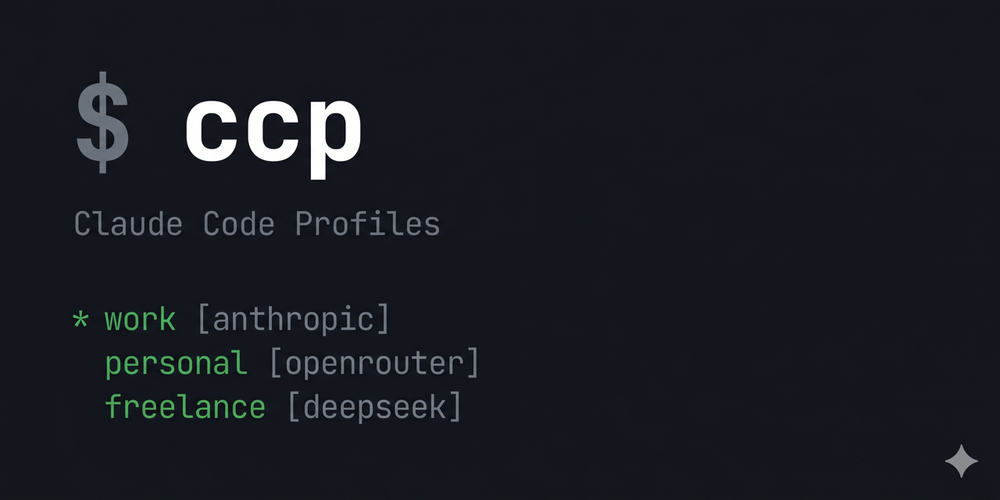

<div align="center">

  

  <h1>ccp: Claude Code Profiles</h1>

  <p>Switch between Claude Code setups with a single command.<br>Different accounts, different providers, different models — each in its own profile.</p>

  <p>No dependencies. Pure bash.</p>

  [](https://github.com/felipeadeildo/claude-code-profiles/releases/latest)
  [](LICENSE)

</div>

---

## Install

```bash
curl -fsSL https://raw.githubusercontent.com/felipeadeildo/claude-code-profiles/main/install.sh | bash
source ~/.zshrc   # or ~/.bashrc
```

## Quickstart

```bash
ccp new work       # create a profile (interactive wizard)
ccp work           # launch claude with that profile
ccp use work       # export its vars into your current shell
```

## How it works

A profile is a `.env` file under `~/.ccp/profiles/`. Each profile gets an isolated `CLAUDE_CONFIG_DIR` — separate settings, history, and todos per profile.

```
~/.ccp/
  profiles/
    work.env
    personal.env
    openrouter.env
  config              # stores the default profile name
  data/               # isolated CLAUDE_CONFIG_DIR per profile
```

Example profile:

```bash
# ~/.ccp/profiles/work.env
CLAUDE_CONFIG_DIR=~/.ccp/data/work
ANTHROPIC_BASE_URL=https://openrouter.ai/api
ANTHROPIC_API_KEY=sk-or-...
```

## Commands

```
ccp list                   list all profiles
ccp new <profile>          create a profile (interactive)
ccp show <profile>         show vars (keys masked)
ccp edit <profile>         open in $EDITOR
ccp remove <profile>       delete a profile

ccp [<profile>] [flags]    launch claude (with optional profile and claude flags)
ccp use <profile>          export vars into current shell
ccp run <profile> <cmd>    run any command with profile vars

ccp default [profile]      get or set the default profile
ccp doctor                 validate all profiles
ccp version                show current version
ccp update                 update to the latest release
```

**Shorthand**: `ccp work --resume` launches claude with the `work` profile and passes `--resume` directly to claude. Bare `ccp` uses the default profile.

**`ccp use` vs `ccp <profile>`**: use `ccp use` when you want vars to persist in your shell session. The shorthand spawns a subprocess — vars are scoped to that invocation only.

## Providers

| Provider       | `ANTHROPIC_BASE_URL`                     | Auth var                      |
|----------------|------------------------------------------|-------------------------------|
| Anthropic      | *(leave blank)*                          | `ANTHROPIC_API_KEY`           |
| OpenRouter     | `https://openrouter.ai/api`              | `ANTHROPIC_API_KEY`           |
| z.ai (GLM)     | `https://api.z.ai/api/anthropic`         | `ANTHROPIC_AUTH_TOKEN`        |
| Kimi           | `https://api.moonshot.ai/anthropic`      | `ANTHROPIC_AUTH_TOKEN`        |
| DeepSeek       | `https://api.deepseek.com/anthropic`     | `ANTHROPIC_AUTH_TOKEN`        |
| Ollama (local) | `http://localhost:11434`                 | `ANTHROPIC_AUTH_TOKEN=ollama` |

The interactive wizard sets the right auth variable automatically.

## Model mapping

Claude Code internally requests `claude-opus`, `claude-sonnet`, etc. If your provider uses different model names, map them in the profile:

```bash
ANTHROPIC_DEFAULT_OPUS_MODEL=glm-4.6
ANTHROPIC_DEFAULT_SONNET_MODEL=glm-4.6
ANTHROPIC_DEFAULT_HAIKU_MODEL=glm-4.5-air
```

The wizard asks for these optionally when creating a profile.

## Updating

```bash
ccp update    # downloads and installs the latest release
ccp version   # show current version
```

ccp checks for updates in the background and notifies you when a new version is available.

---

*Want to contribute? See [CONTRIBUTING.md](CONTRIBUTING.md).*
